# Proyecto de análisis de datos con Pandas e integración TMDB y NLP con IA
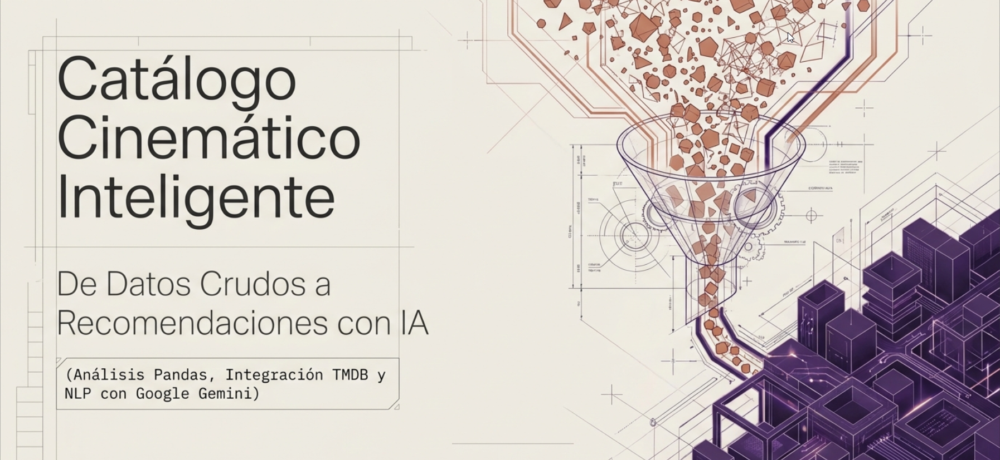

## Cómo esta organizado este documento

Se destacan las siguientes secciones dentro del proyecto:

* **Exposición de Objetivos** - definición dada del caso y sus fases.
* **Desarrollo de la Metodología de Implantación** - técnicas de abordaje del desarrollo técnico entorno a cada fase.
* **Conclusión Técnica** - aspectos a remarcar y visión de la evolución.
* **Observaciones de Desarrollo** - apuntes del equipo en base a la experiencia vivida (retrospectiva rápida).

## Exposición de objetivos  

El proyecto es presentado al equipo de desarrollo como `Markdown` en un `Jupyter notebooks`, con las celdas correspondientes a cada fase, con el fin de tener un punto común de actuación y por hacerlo más fácil esta vez.  

Se centra en la creación de un catálogo de películas integrando el análisis de datos y la inteligencia artificial en 4 fases con funcionalidades ampliadas.

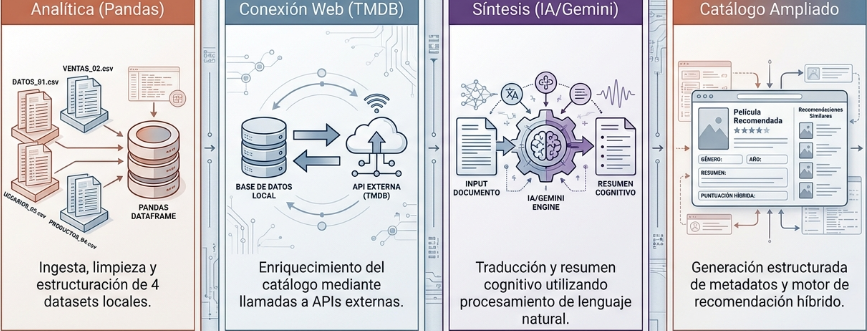

Se requiere como entorno colaborativo la plataforma de **GitHub**, estableciendo **main** como rama principal protegida de actualizaciones (únicamente el Scrum Master atiende los `pull request` del equipo), una rama **devel** de donde parten el resto de ramas del flujo de trabajo de desarrollo, planteándose de esta forma la resolución de conflictos en una fase anterior al mergeado de los cambios hacia la rama principal.

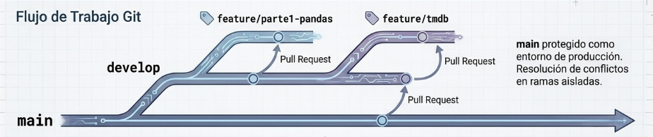

## Desarrollo de la Metodología de Implantación

### Parte 1 — Data Analytics (Pandas)

Ingesta, limpieza y unificación de archivos CSV crudos:

* **Ingesta de datos:** Carga con Pandas de los 4 datasets CSV (`movies.csv`,`ratings.csv`,`tags.csv`,`links.csv`) desde la carpeta`data/`. Inspección inicial con`shape`, columnas,`dtypes`,`head()`y conteo de nulos.
* **Extracción del año:** Función `year*from*title` que extrae el año de estreno (patrón entre paréntesis al final del título) como columna numérica `year`. Limpia el campo `title` quitando el año. Identifica títulos sin año reconocible como casos límite.
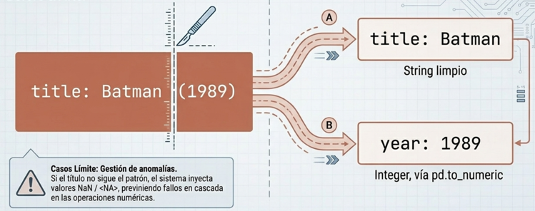

> Representa por tanto una transformación estricta, mediante la separación de un string crudo en dos columnas tipadas, asegurando integridad en casos en los que no hay un patrón claro de año.

* **Sistema de datos unificado (merge/join):** Construcción de un esquema unificado usando `movieId` y `tmdbId` como claves, generando tablas enriquecidas (película–usuario–rating y película–tags) con `pd.merge()`. Documenta qué filas se pierden o multiplican.
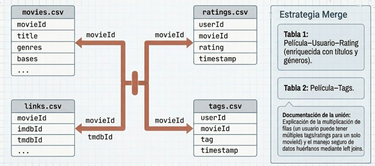

* **Agregaciones y segmentación:** `groupby`por usuario/película/género con agregaciones multi-columna (`agg`). Comparativa de segmentos (ej. usuarios activos vs. inactivos, décadas).

> A valorar la expansión natural de la cardinalidad al cruzar un título con múltiples usuarios y valoraciones. Al igual que el manejo de descartes mediante la justificación sistemática de filas omitidas.

* **Preguntas analíticas sobre los datos:** 10 consultas concretas: total de películas, más antiguas, coincidencias parciales ("**Dracula**"), títulos más comunes, filtrado por *tags múltiples, tag más repetida*, etc.
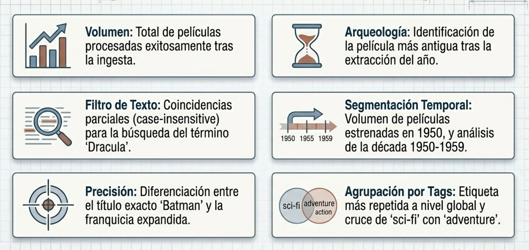

> Los *insights* del catálogo representan una radiografía analítica en cuanto a aspectos como géneros, cronologías, y volúmenes-extremos.

### Parte 2 — Petición HTTP a la API de TMDB

* Construcción del DataFrame `movies10` con las 10 primeras películas que tienen `tmdbId`.

* Función `fetch_movie_details(tmdb_id)` que realiza un `GET /3/movie/{id}` y extrae `overview` (sinopsis) y `homepage`.  

> Como *lógica de degradación* 'elegante' se inyecta texto vacío para preservar la integridad estructural del data-frame 'enriquecido' en aquellos casos en los que el servidor pueda devolver un valor nulo.

* Autenticación vía `.env` (`TMDB_READ_ACCESS_TOKEN` y `TMDB_API_KEY`) favoreciendo así la protección de secretos, al estar el archivo explicitado en `.gitignore` para evitar la subida local de las claves exponiendo dos métodos de inyección dinámica vía `python-dotenv` o `getpass`.  
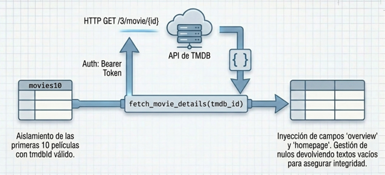

### Parte 3 — Sinopsis en español con Gemini

Representa la capa cognitiva al proveer de traducción y síntesis en sinopsis mediante IA:

* Carga de variables de entorno desde `.env` con `python-dotenv` para `GEMINI_API_KEY`y `GEMINI_MODEL` (fallback: `getpass` si no hay clave), garantizando la gestión segura de secretos en todas las fases.  

> Aquí decidimos crear un `.env.example`en el proyecto con *valores dummy* de lo que son las variables a definir para los servicios API de TMDB-Gemini. Simplemente hacer una copia del archivo y renombrarlo como `.env` para poner las claves propias de cada uno para que sea consumido durante el tiempo de ejecución.  
> Esto no modifica el funcionamiento original, si no se configura *fallback* a input por teclado como está estipulado.  
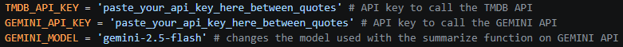

* Función `summarize_overview_es(overview, title="")` que invoca el modelo **Gemini AI** mediante `google-genai` para generar un resumen de máximo 2 frases en español sin alterar el significado original. Si la sinopsis está vacía se omite la llamada a la API.  
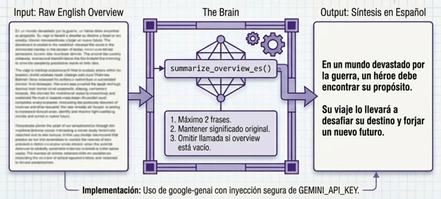

> Lo que produce un resumen estructurado y conciso en español, listo para análisis y/o consumo, forzando por esto el paso hacia una nueva estructura de datos con LLMs.

* Aplicación vectorizada sobre `movies10` mediante`DataFrame.apply()`con función lambda, añadiendo la columna `overview*es`.  
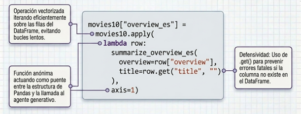

> Integra los resultados del modelo de lenguaje en data-frame expandido con otra columna.

# Conclusión técnica

Por todo lo anterior, resulta patente la evolución tecnológica mediante las distintas implementaciones practicadas que redunda en, cada vez mayor 'inteligencia/autonomía' en la gestión de cambios y/o añadidos al catálogo. Pudiendo llevarse, en este punto actual, la implementación a grados más altos de automatización.

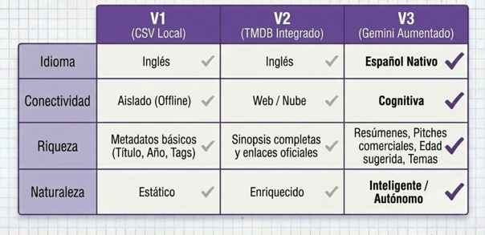

La cuestión a señalar aquí es el ahorro de tiempo, de medios de producción y la ausencia de fallos (o prácticamente) al ir el catálogo acompañado del *esfuerzo de desarrollo de software preciso* guiado por el *adecuado análisis y tratamiento de datos e inyección de partes basadas en* **Natural Language Processing**; ayudando de este modo a una *mejor clasificación*, un *crecimiento adecuado y sostenible*, además de permitir *mayor agilidad en cambios masivos e iterativos*, que se produce en este *marco tecnológico vigente*, y pudiendo cómodamente **escalar en servicios y funcionalidades** a corto plazo mediante esfuerzos de desarrollo concretos.  

En resumen, y como *síntesis* o *arquitectura completa del sistema*, podemos presentar un **flujo de datos continuo**, **resiliente a valores nulos** y **automatizado** de principio a fin. Y donde Pandas proporciona la estructura matemática, TMDB el contexto global y Gemini añade la comprensión semántica ausente hasta ese momento para el mercado de hispanohablantes. Luego ningún motor trabaja de forma aislada para crear el producto final, resulta de la combinación de todos.

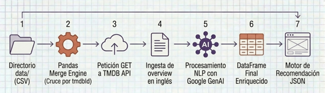

## Observaciones de Desarrollo

Es preciso comentar que la falta de algunos miembros del equipo en momentos puntuales, quizá haya retrasado innecesariamente el desarrollo general del proyecto. 

Al hilo de lo anterior, destacar que para futuras iteracciones se requeriría mayor sincronía e intercolaboración. Ampliar el set de herramientas creativas, como puede ser el *brainstorming*, así como el *apoyo táctico* del desarrollo en puntos en los que debería haber mayor cohesión como equipo, mejorando la dinámica de forma general. Y que habría impulsado los resultados a otro nivel, no solo cuantitativo, sino también cualitativo. Aspectos que son, a todas luces, un **punto de mejora importante** a tener en cuenta y que produciría mejores *outputs* con pocos *inputs*, con poco esfuerzo.